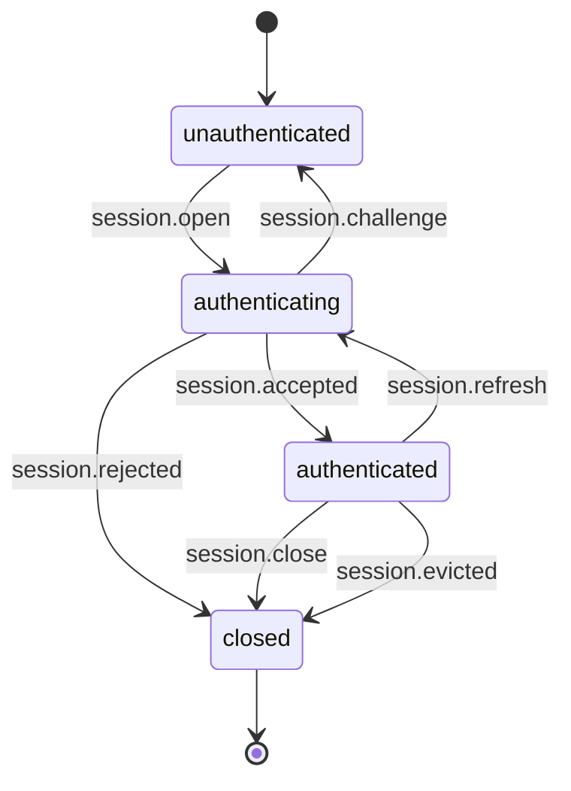
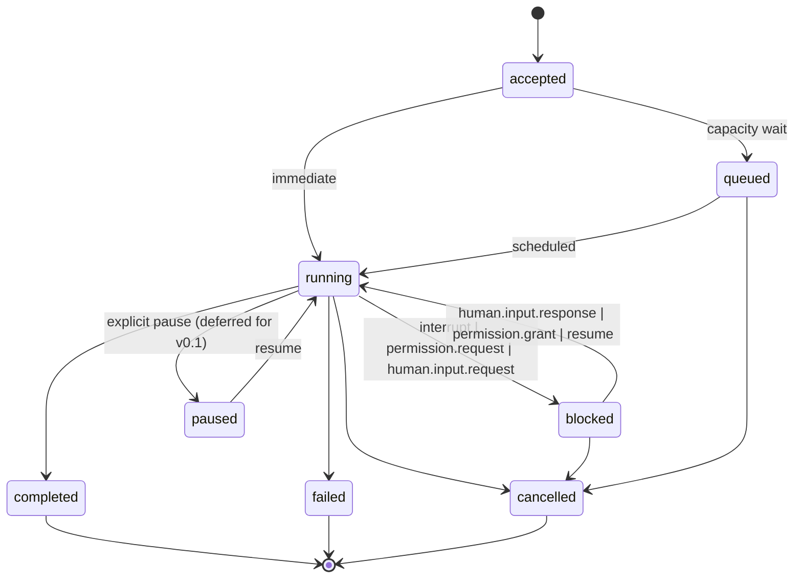
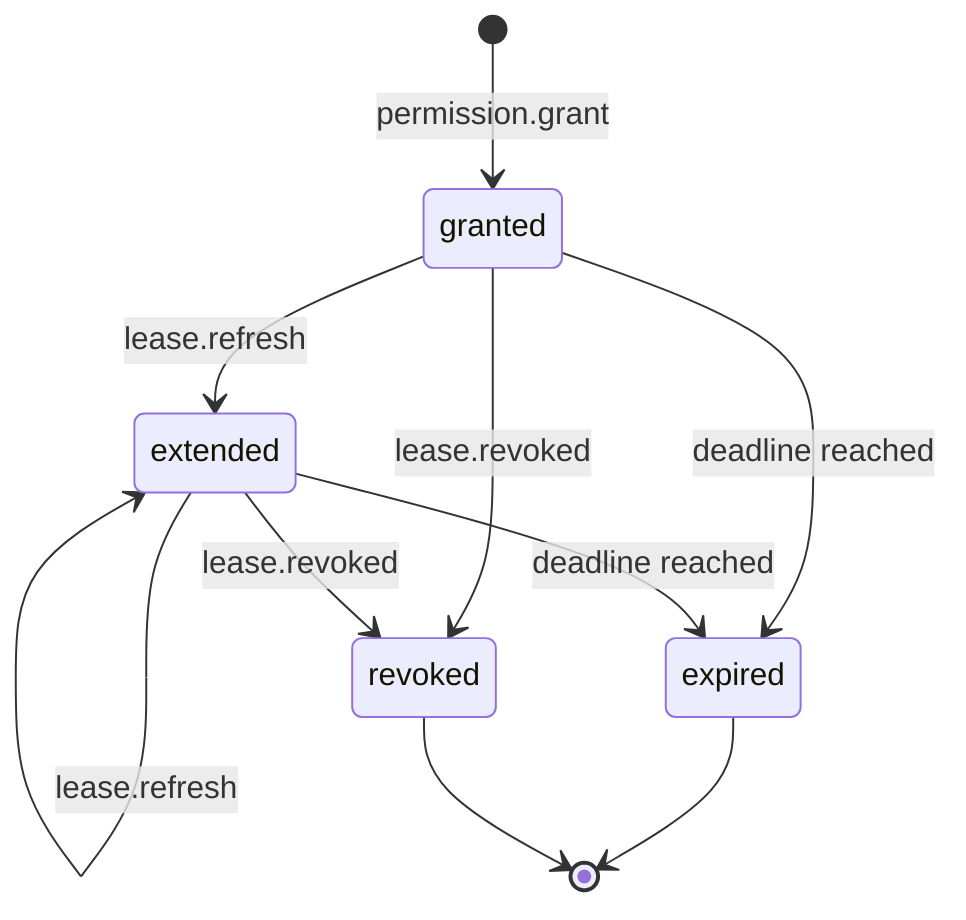

# ARCP Ruby SDK — Implementation Plan

This is the Phase 0 plan for the ARCP Ruby SDK reference implementation
(`arcp` gem, version 0.1.0, protocol version 1.0). It is the working
contract between the build prompt and the implementation. Where the
build prompt and `RFC-0001-v2.md` disagree, the RFC wins; conflicts are
flagged below.

## 1. Scope summary

The v0.1 cut implements every protocol surface listed in the build
prompt's "In scope for v0.1" section in full, raises
`Arcp::Error::Unimplemented` for explicitly out-of-scope features, and
ships a working WebSocket transport, stdio transport, SQLite event log,
CLI, and six runnable samples.

In scope (full implementation): envelope (§6.1) including
`idempotency_key`, `priority`, `extensions`, `correlation_id`,
`causation_id`; `bearer`, `signed_jwt`, and `none` auth schemes (§8);
capability negotiation (§7); stateless and stateful sessions (§9 less
durable persistence); jobs (§10) including state machine, heartbeats,
cancellation, interrupts; streams (§11) with `text`, `event`, `log`,
`thought` kinds, base64 binary only, backpressure; human-in-the-loop
(§12) including expiration with default fallback; permissions and
leases (§15.1, §15.4, §15.5) full challenge flow; subscriptions (§13)
with filters, backfill, `subscription.backfill_complete`; artifacts
(§16) inline base64 only; the canonical error taxonomy (§18); the
extension mechanism (§21); observability (§17) for `log`, `metric`,
`trace.span`; WebSocket and stdio transports (§22 mandatory); SQLite
event log with idempotency, replay, message-id resume.

Out of scope for v0.1, raised as `Arcp::Error::Unimplemented` when
called: HTTP/2 and QUIC transports; `mtls` and `oauth2` auth schemes;
sidecar binary stream frames (§11.3); scheduled jobs (§10.6);
multi-agent delegation/handoff (§14); workflow primitives; trust
elevation (§15.6); checkpoint-based resume (§19) — message-id resume
only; artifact retention beyond simple periodic expiry; quorum response
policies for human input — first-response-wins only; durable session
recovery (§9 partial); JRuby/TruffleRuby; Rails integration helpers.

## 2. RFC section summaries and Ruby mapping

### §6 Core protocol concepts

The envelope is the canonical message container. Implementation: an
immutable `Arcp::Envelope` value object via `Data.define`, carrying
every field listed in §6.1.1 plus a `payload` member that is itself a
`Data.define` whose class is the discriminator for `case/in` dispatch.
Two distinct idempotency keys live on the envelope: `id` (transport,
mandatory) and `idempotency_key` (logical, optional, scoped to
`(session_principal, idempotency_key)` per §6.4). `priority` is one of
`Arcp::Priority::LOW | NORMAL | HIGH | CRITICAL`. Ordering is preserved
within `stream_id` and `job_id` per §6.4 — implemented by serializing
writes to a per-stream/per-job mailbox.

### §7 Capability negotiation

A Ruby `Hash` keyed by symbol (`:streaming`, `:durable_jobs`,
`:checkpoints`, `:binary_streams`, `:agent_handoff`, `:human_input`,
`:artifacts`, `:subscriptions`, `:scheduled_jobs`, `:extensions`).
Treat absent keys as `false` per the RFC. A `:heartbeat_interval_seconds`
(default 30) and `:heartbeat_recovery` (`"fail"` | `"block"`, default
`"fail"`) live alongside the booleans. Required-but-unsupported
features yield `session.rejected` with `code: UNIMPLEMENTED`.

### §8 Authentication and identity

Implemented schemes for v0.1:

- `bearer` — opaque token validated against an in-memory token list.
  The runtime accepts any non-empty token if `accept_any: true`; tests
  use a known list.
- `signed_jwt` — JWT validated via the `jwt` gem. The runtime accepts
  HS256 with a configured secret in v0.1; RS256/ES256 are accepted only
  when an explicit `algorithms:` argument is passed at construction
  (this matches the `jwt` gem's safety guidance — never trust the JWT
  header `alg`).
- `none` — only valid when `capabilities.anonymous: true` was
  negotiated; otherwise the runtime returns `session.rejected` with
  `code: UNAUTHENTICATED`.

`mtls` and `oauth2` are deferred. Calling them yields
`session.rejected` with `code: UNIMPLEMENTED` and a structured detail
pointing to RFC §8.2.

The four-step handshake is implemented in
`Arcp::Runtime::Session`. Until `session.accepted` is received,
non-handshake messages are dropped and logged.

### §9 Sessions

Stateless and stateful sessions both implemented. `stateful` is a
property of the session record carried in the runtime's session map.
Durable sessions (across reconnects) are deferred — calling
`runtime.resume(session_id: ...)` for a session that is no longer in
memory returns `code: NOT_FOUND` rather than rebuilding the session
from disk. This is sufficient for v0.1 because §19 message-id resume
within a still-live session is supported.

### §10 Jobs

State machine: `:accepted`, `:queued`, `:running`, `:blocked`,
`:paused`, `:completed`, `:failed`, `:cancelled`. Transitions live in
`Arcp::Runtime::JobManager#transition!`, which is the only entry point
that can mutate a `JobRecord`'s state. Each running job is a child
`Async::Task` of the runtime's root task. Heartbeats default to 30s,
N=2 missed-deadline policy. Heartbeat detection uses an injected
`clock:` that responds to `#now`, never `Time.now` directly. On
`heartbeat_recovery: "fail"` the job transitions to `:failed` with
`code: HEARTBEAT_LOST`; on `"block"` it moves to `:blocked` and the
runtime emits a recovery `human.input.request`.

Cancellation per §10.4: cooperative within `deadline_ms`, escalates to
`task.stop` after the deadline, terminal event is `job.cancelled` for
jobs and `stream.error` with `code: CANCELLED` for streams.

Interrupts per §10.5: state → `:blocked`, emit `human.input.request`,
resume on response or `cancel`. `capabilities.interrupt: false` clients
fall back to `cancel`.

Scheduled jobs (§10.6) are deferred.

### §11 Streaming

Stream kinds: `text`, `event`, `log`, `thought`. `binary` is supported
in-envelope (base64) only; sidecar frames are deferred — `stream.open`
with sidecar requested returns `nack` with `code: UNIMPLEMENTED`.
Backpressure (`backpressure` message) consumed via
`Arcp::Runtime::StreamManager#apply_backpressure!`, which lowers the
producer's emit rate by reducing the bounded `Async::LimitedQueue`'s
capacity for that stream until the next chunk acknowledgement.

Per-stream sequence numbers are assigned monotonically by the writer.
Reasoning streams (§11.4) carry `role` and `redacted: bool`.

### §12 Human-in-the-loop

`human.input.request`, `human.input.response`, `human.choice.request`,
`human.choice.response`, `human.input.cancelled`. `response_schema` is
validated with `json_schemer`. Expiration is implemented via
`Async::Task#with_timeout`: on deadline, if `default` is set the
runtime synthesizes a `human.input.response` with
`responded_by: "default"`; otherwise it emits `human.input.cancelled`
with `code: DEADLINE_EXCEEDED`. First-response-wins: subsequent
responses are dropped; `human.input.cancelled` is emitted to other
destinations as a courtesy.

### §13 Subscriptions

Filters are AND-of-OR per §13.2. The filter compile step rejects
unauthorized fields with `code: PERMISSION_DENIED`. Backfill is
delivered by reading from the SQLite event log up to a snapshot, then
emitting a synthetic `subscribe.event` carrying an `event.emit` of type
`subscription.backfill_complete` per §13.3, then connecting to the live
tail. Termination via `unsubscribe` or `subscribe.closed`.

### §15 Permissions

Permission challenge flow (§15.4) and full lease lifecycle (§15.5):
`lease.granted`, `lease.refresh`, `lease.extended`, `lease.revoked`.
Trust levels (§15.3) are surfaced in `session.accepted.runtime.trust_level`
but not actively enforced for v0.1 — runtime always sets `trusted` and
elevation (§15.6) is deferred.

### §16 Artifacts

Inline base64 only. `artifact.put` accepts `payload.data` (base64) and
returns an `artifact.ref`. `artifact.fetch` returns the inline data.
`artifact.release` removes the artifact and unblocks GC. Retention is
enforced by a periodic child task with default 1h sweep interval. The
backing store is SQLite (BLOB column).

### §17 Observability

`log`, `metric`, `trace.span` envelopes implemented. Standard metric
names live as frozen string constants in
`Arcp::Telemetry::StandardMetrics`. Trace context propagates via
fiber-local storage (`Fiber[:arcp_trace]`).

### §18 Errors

Canonical taxonomy as frozen string constants in
`Arcp::ErrorCode`. `Arcp::Error` exception hierarchy with subclasses
for each canonical code, plus structured fields (`permission`,
`resource`, `lease_id`, `expired_at`, etc.). `retryable?` flag follows
§18.3.

### §19 Resumability

Message-id resume only. `resume.payload.after_message_id` triggers
replay from the SQLite event log of every event with
`monotonic_seq > seq_of(after_message_id)`, ordered by `monotonic_seq`.
Checkpoint-based resume is deferred — a `checkpoint_id` in the resume
request returns `code: UNIMPLEMENTED`.

### §21 Extensions

`Arcp::ExtensionRegistry` accepts namespaced types matching
`/\Aarcpx\.[a-z][a-z0-9-]*\.[a-z][a-z0-9-]*\.v\d+\z/` or reverse-DNS
`/\A[a-z][a-z0-9-]*(\.[a-z][a-z0-9-]*)+\.v\d+\z/`. The bare `x-` prefix
is rejected for envelope fields. Unknown core types yield `nack` with
`code: UNIMPLEMENTED`. Unknown namespaced types yield `nack` unless the
sender set `extensions.optional: true`, in which case they are silently
dropped per §21.3.

## 3. Message-type-to-class mapping

Each message type maps to a `Payload = Data.define(...)` declared inside
a class that exposes `type_name`, `from_hash(h)`, and an instance method
`to_h`.

| Wire type | Ruby class | File |
| --- | --- | --- |
| `session.open` | `Arcp::Messages::Session::Open` | `messages/session.rb` |
| `session.challenge` | `Arcp::Messages::Session::Challenge` | `messages/session.rb` |
| `session.authenticate` | `Arcp::Messages::Session::Authenticate` | `messages/session.rb` |
| `session.accepted` | `Arcp::Messages::Session::Accepted` | `messages/session.rb` |
| `session.unauthenticated` | `Arcp::Messages::Session::Unauthenticated` | `messages/session.rb` |
| `session.rejected` | `Arcp::Messages::Session::Rejected` | `messages/session.rb` |
| `session.refresh` | `Arcp::Messages::Session::Refresh` | `messages/session.rb` |
| `session.evicted` | `Arcp::Messages::Session::Evicted` | `messages/session.rb` |
| `session.close` | `Arcp::Messages::Session::Close` | `messages/session.rb` |
| `ping` / `pong` / `ack` / `nack` | `Arcp::Messages::Control::{Ping,Pong,Ack,Nack}` | `messages/control.rb` |
| `cancel` / `cancel.accepted` / `cancel.refused` | `Arcp::Messages::Control::{Cancel,CancelAccepted,CancelRefused}` | `messages/control.rb` |
| `interrupt` | `Arcp::Messages::Control::Interrupt` | `messages/control.rb` |
| `resume` | `Arcp::Messages::Control::Resume` | `messages/control.rb` |
| `backpressure` | `Arcp::Messages::Control::Backpressure` | `messages/control.rb` |
| `tool.invoke` | `Arcp::Messages::Execution::ToolInvoke` | `messages/execution.rb` |
| `tool.result` | `Arcp::Messages::Execution::ToolResult` | `messages/execution.rb` |
| `tool.error` | `Arcp::Messages::Execution::ToolError` | `messages/execution.rb` |
| `job.accepted` etc. | `Arcp::Messages::Execution::Job{Accepted,Started,Progress,Heartbeat,Completed,Failed,Cancelled}` | `messages/execution.rb` |
| `stream.open/chunk/close/error` | `Arcp::Messages::Streaming::Stream{Open,Chunk,Close,Error}` | `messages/streaming.rb` |
| `human.input.request/response/cancelled`, `human.choice.request/response` | `Arcp::Messages::Human::*` | `messages/human.rb` |
| `permission.request/grant/deny`, `lease.granted/extended/revoked/refresh` | `Arcp::Messages::Permissions::*` | `messages/permissions.rb` |
| `subscribe`, `subscribe.accepted`, `subscribe.event`, `unsubscribe`, `subscribe.closed` | `Arcp::Messages::Subscriptions::*` | `messages/subscriptions.rb` |
| `artifact.put/fetch/ref/release` | `Arcp::Messages::Artifacts::*` | `messages/artifacts.rb` |
| `event.emit`, `log`, `metric`, `trace.span` | `Arcp::Messages::Telemetry::*` | `messages/telemetry.rb` |

Out-of-scope wire types (`workflow.start`, `workflow.complete`,
`agent.delegate`, `agent.handoff`, `job.schedule`,
`job.checkpoint`, `checkpoint.create`, `checkpoint.restore`) are
declared in the registry as `Arcp::Messages::Unimplemented` shells so
the parser can recognize and `nack` them with `code: UNIMPLEMENTED`
rather than `code: UNKNOWN`.

## 4. State machines

### Session



### Job



### Lease



## 5. Open questions and chosen interpretations

1. **§6.1.1 `target` semantics.** The RFC describes `target` as a
   logical recipient id but does not say what happens when a runtime
   receives a message whose `target` does not match its own identity.
   *Chosen interpretation:* the runtime ignores `target` for routing
   and uses `session_id` only. `target` is preserved on the wire for
   observability. Documented in `CONFORMANCE.md`.
2. **§7 absent boolean capabilities.** The RFC says receivers must
   treat absent boolean capabilities as `false`. *Chosen interpretation
   for v0.1:* this also extends to non-boolean capabilities being
   absent (e.g. `heartbeat_interval_seconds`), in which case the
   runtime falls back to its declared default rather than rejecting.
   This matches the spirit of "negotiate down."
3. **§9 durable session.** `Closing a session via session.close is
   graceful. Open jobs MUST be either cancelled, completed, or
   detached for later resumption.` *Chosen interpretation:* if the
   client supplied `payload.detach: true` on `session.close`, jobs are
   detached (in v0.1, "detached" means they keep running; resumption
   under a new session is deferred). Otherwise they are cancelled.
4. **§10.3 `deadline_ms` semantics.** `job.heartbeat.payload.deadline_ms`
   is the time before the next heartbeat is required. *Chosen
   interpretation:* if the payload omits `deadline_ms`, the runtime
   uses the negotiated `heartbeat_interval_seconds * 1000`.
5. **§11.3 `payload.sequence` for binary chunks.** *Chosen
   interpretation:* every `stream.chunk` carries a `sequence` integer,
   monotonic per `stream_id`, regardless of stream kind. Receivers can
   detect drops.
6. **§12.4 expiration with no `default`.** *Chosen interpretation:* if
   `expires_at` passes and no `default` was provided, the runtime
   emits `human.input.cancelled` with `code: DEADLINE_EXCEEDED`. The
   blocking job transitions to `:failed` with the same code unless the
   runtime advertises `capabilities.human_input_escalate: true`, which
   is not implemented in v0.1.
7. **§16.1 `expires_at` on artifact refs.** *Chosen interpretation:*
   absent `expires_at` means "respect runtime default retention." The
   runtime always populates this field on emit.
8. **§19 retention window.** *Chosen interpretation:* the SQLite event
   log retains messages for 7 days by default; the value is
   configurable on `Arcp::Store::EventLog.new(retention_seconds:)`.
   Messages older than retention are pruned by a periodic child task.
9. **§21.1 `arcpx.<vendor>.<name>.v<n>` casing.** The RFC uses
   lowercase. *Chosen interpretation:* the registry rejects mixed
   case in vendor and name segments.

## 6. Test plan

### Unit (`spec/unit/`)

- `envelope_spec.rb` — envelope round-trip, equality, frozen, missing
  required fields raise, all canonical envelope fixtures (one per
  message type) parse and re-serialize byte-equal modulo key order.
- `ids_spec.rb` — every `Data.define` newtype has `random`, validation,
  `to_s`, `to_json`. Mixing types is detected by `case/in` and `is_a?`.
- `error_spec.rb` — every `Arcp::Error` subclass exposes `code`, the
  registered code matches `ErrorCode::*`, `retryable?` follows §18.3,
  serialization to a `tool.error` payload round-trips.
- `extensions_spec.rb` — namespace acceptance/rejection per §21.1; bare
  `x-` rejected; unknown core type yields `UNIMPLEMENTED`; unknown
  namespaced with `extensions.optional: true` is silently dropped;
  without it yields `UNIMPLEMENTED`.
- `messages_spec.rb` — every message round-trips via `from_hash`/`to_h`
  and `Json.encode_envelope`/`Json.decode_envelope`.
- `store/event_log_spec.rb` — idempotent insert (UNIQUE on `id`),
  replay ordering by `monotonic_seq`, retention sweep deletes
  expired rows, parameterized queries (no string concat).

### Integration (`spec/integration/`)

All run over the in-memory transport unless noted; reused as
shared examples for stdio + WebSocket in Phase 6.

- `handshake_spec.rb` — happy path for each implemented auth scheme;
  challenge flow; `none` rejected without `anonymous: true`;
  unimplemented schemes yield `code: UNIMPLEMENTED`.
- `job_lifecycle_spec.rb` — accept → start → progress → complete;
  failure path; cancellation path; deterministic clock.
- `human_input_spec.rb` — input request/response; choice; expiration
  with default fallback; expiration without default emits cancelled.
- `permission_lease_spec.rb` — challenge → grant → use → expiry; revoke
  before expiry; deny rejects with `PERMISSION_DENIED`.
- `subscription_spec.rb` — filter by every dimension; backfill
  ordering; backfill→live boundary marker; auth-expiry termination.
- `cancellation_spec.rb` — cooperative cancel within deadline; hard
  abort on deadline elapse; `cancel.refused` for terminal job.
- `interrupt_spec.rb` — interrupt → blocked → human.input.request →
  resume; cancel during interrupt → cancelled.
- `artifact_spec.rb` — put → fetch → release; retention sweep; fetch
  after release returns NOT_FOUND.
- `resume_spec.rb` — `resume` with `after_message_id` replays in
  order; missing message id (pruned) returns DATA_LOSS.
- `extension_unknown_spec.rb` — unknown namespaced types treated per
  §21.3; unknown core type rejected.

### E2E (`spec/e2e/`)

- `relay_scenario_spec.rb` — full agent-relay scenario from
  `examples/agent-relay-human-input.jsonl` runs against both transports
  via shared examples.

### Performance smoke

In-process round-trip p99 < 50ms for human input request → response on
the memory transport. Asserted with a tagged `:performance` example
that the default RSpec invocation does not run; the gate runs it
explicitly.

## 7. Ruby-specific notes

- **`Data.define`.** Used for every value object (envelope, ids,
  payloads, lease records). Gives structural equality (`==`, `hash`,
  `eql?`), immutability, `to_h`, `with(...)`, `deconstruct_keys` for
  pattern matching out of the box.
- **`case/in` dispatch.** Pattern matches on payload class. Raises
  `NoMatchingPatternError` if no arm matches. Exhaustiveness is a
  runtime property, not compile-time. Tests must cover every payload
  shape; we add a registry-backed test that asserts every registered
  message type has a dispatch arm.
- **Async via the `async` gem.** Synchronous-style fiber code,
  `Async { ... }.wait`, `task.with_timeout(seconds)`,
  `Async::Notification` for one-shot waits, bounded `Async::LimitedQueue`
  for backpressured streams. No threads for protocol concerns. `Mutex`
  is acceptable for guarding small shared-state regions accessed from
  multiple fibers (e.g. the pending registry, the session map). The
  `Mutex` integrates correctly with the async gem because the reactor
  yields to other fibers when a fiber is blocked on the mutex.
- **Trace context per fiber.** `Fiber[:arcp_trace]` propagates context
  across fiber suspension boundaries. A helper `Arcp::Tracing.with`
  scopes context and restores on exit.
- **SQLite via the `sqlite3` gem.** Synchronous API; for v0.1 we accept
  blocking the reactor on event-log writes since they are sub-ms in
  practice. If a deployment cares, the event log can be moved to a
  separate thread and bridged via `Async::Channel`. Documented as a
  known tradeoff. Schema lives at `lib/arcp/store/schema.sql` and is
  applied on `EventLog.new`.
- **JSON.** Stdlib `JSON` only; no Oj or ActiveSupport. The
  `Arcp::Json` module owns envelope encode/decode; it uses
  `JSON.parse(json, symbolize_names: true)` for inbound and
  `JSON.generate(hash.compact)` for outbound.
- **Logging.** Stdlib `Logger`-compatible. `Arcp::Runtime::Runtime.new`
  and `Arcp::Client::Client.new` accept a `logger:` keyword defaulting
  to `Logger.new(IO::NULL)`. We never `puts` from library code.
- **CLI.** `dry-cli` for command definition. `exe/arcp` is a one-line
  shim that requires the gem and dispatches to the registry.
- **RBS.** Skeleton signatures may be added under `sig/arcp.rbs`.
  Steep is not gated for v0.1.

## 8. Dependency justification

Runtime:

- `async` ~> 2.0 — fiber-based reactor; the modern Ruby async stack.
- `async-websocket` ~> 0.30 — WebSocket client + server on `async`.
- `sqlite3` ~> 2.0 — SQLite bindings for the event log and artifact
  store; widely available; C extension is acceptable on Ruby 3.3+.
- `jwt` ~> 2.0 — JWT validation for `signed_jwt` auth.
- `json_schemer` ~> 2.0 — JSON Schema validation for
  `human.input.request.response_schema`.
- `dry-cli` ~> 1.0 — CLI framework; lighter than Thor.
- `securerandom` (stdlib) — used for ULID generation. We do not depend
  on a third-party `ulid` gem; the protocol only requires sortable
  unique strings, and we ship a hand-rolled implementation in
  `lib/arcp/ids.rb` that produces 26-character Crockford-base32 strings
  with millisecond timestamp + 80 bits of randomness. This avoids a
  dependency on an unmaintained gem.

Development:

- `rspec` ~> 3.13
- `rubocop` ~> 1.60 + `rubocop-rspec` + `rubocop-performance`
- `simplecov` for coverage
- `yard` for documentation (gate runs with `--fail-on-warning`)

We do not add: Rails, ActiveSupport, Sidekiq, EventMachine,
Concurrent Ruby, Faraday, HTTParty, Thor, Oj, RSpec-mocks beyond
what `rspec-mocks` ships, factory_bot.

## 9. RuboCop configuration deviations

Defaults from rubocop, rubocop-rspec, and rubocop-performance with
`NewCops: enable`, plus the following deviations (each justified):

- `Metrics/MethodLength: Max: 20` (default 10) — protocol parsers and
  the dispatcher pattern matches need more lines than the default.
- `Metrics/ClassLength: Max: 250` — the runtime aggregator needs room.
- `Metrics/ModuleLength: Max: 250` — same for the message module.
- `Style/Documentation: Enabled: false` — YARD covers public API; the
  RuboCop variant nags on private constants.
- `RSpec/ExampleLength: Max: 25` — protocol round-trip examples.
- `RSpec/MultipleExpectations: Max: 8` — protocol round-trip examples.
- `RSpec/NestedGroups: Max: 5` — handshake variants nest by scheme.
- `Naming/AccessorMethodName: Enabled: false` — protocol `set_*`
  helper methods read better than property setters.
- `Style/FrozenStringLiteralComment: EnforcedStyle: always` — required
  by the build prompt.

## 10. Exhaustiveness strategy

Ruby has no compile-time exhaustiveness check on `case/in`. We close
the gap with three measures:

1. The `MessageTypeRegistry` enumerates every known payload class.
2. The runtime's dispatcher tests build envelopes of every registered
   type from canonical fixtures and assert each lands in a defined
   handler arm.
3. The default arm of every `case/in` raises
   `Arcp::Error::Internal.new(detail: "unhandled type ...")`. Any
   regression where a payload class is added but no arm handles it
   surfaces immediately under test rather than at deployment.

## 11. Newtype discipline strategy

Ruby cannot prevent passing a `MessageId` where a `SessionId` is
expected at the language level. We close the gap with:

1. Distinct `Data.define` classes per id type. They have different
   `class` and pattern-match shape. `case/in` treats them as distinct.
2. A `spec/unit/ids_spec.rb` example asserts that mixing id types
   trips an explicit type check at every public API boundary
   (constructor `kind:` argument or `is_a?` guard inside the runtime).
3. Optional RBS signatures under `sig/` declare the id types and let
   Steep flag mismatches.

## 12. Gate command set

The standard gate command set, in order:

```
bundle install
bundle exec rubocop
bundle exec rspec --format documentation
bundle exec yard --fail-on-warning
bundle exec rake build
```

A successful gate requires every command to exit 0 and (where
applicable) produce no warnings. `simplecov` runs as part of `rspec`;
the gate verifies coverage threshold ≥ 85% on `lib/arcp` overall, ≥ 90%
on Phase 1 files specifically.

## 13. Phase plan recap

- Phase 0: this document, gem skeleton, RuboCop and RSpec wired,
  empty test passes the gate.
- Phase 1: envelope, ids, errors, extensions, event log + specs.
- Phase 2: messages, session handshake, capability negotiation +
  specs over the in-memory transport.
- Phase 3: jobs, streams, cancellation, interrupts + specs (deterministic
  clock, async-aware).
- Phase 4: human-in-the-loop, permissions, leases + specs.
- Phase 5: subscriptions, artifacts, resume + specs.
- Phase 6: WebSocket and stdio transports + shared examples.
- Phase 7: CLI, samples, README, CONFORMANCE, YARD, e2e relay + tag.

Each phase ends with a passing gate and a commit. The final tag is
`v0.1.0`.
